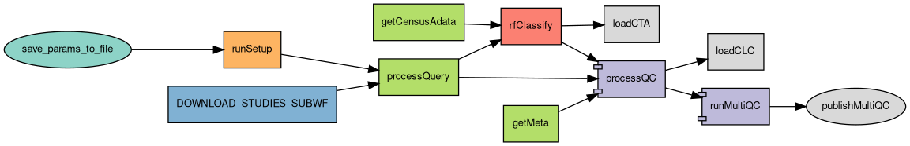

# Nextflow Pipeline for Automated Single-Cell Annotation

Nextflow pipeline designed to automatically annotate cell types from single-cell data loaded into the Gemma database. Cell types are assigned using a random forest classifier trained on `scvi` embeddings from the CellxGene data corpus [1][2][3].

## Table of Contents
- [Features](#features)
- [Requirements](#requirements)
- [Installation](#installation)
- [Usage](#usage)
- [Parameters](#parameters)
- [Input](#input)
- [Output](#output)
- [MultiQC Report](#multiqc-report)
- [Workflow Description](#workflow_description)

---

## Features

- Downloads scVI model based on provided organism and CELLxGENE census version.
- Generates embeddings for query data using pre-trained model.
- Pulls reference datasets and model embeddings from CellxGene census data given an organism and collection names.
- Performs cell type classification of query datasets using a random forest model trained on scVI embeddings.
- Supports individual sample processing with `process_samples` (skips QC and combines outputs).
- Optionally loads cell-level characteristics with outlier statistics using `--mask` flag.
- Uploads re-annotated cell types to [gemma.msl.ubc.ca](https://gemma.msl.ubc.ca/home.html)
- Summarizes QC metrics per-sample in a custom MultiQC report.
- Saves runtime parameters and outputs in a specified directory.

---

## Requirements

- **Nextflow** (=24.10.0)
- **Conda** (for environment management)
- My own conda environments are currently hard-coded into the pipeline (I will set up singularity environments in the future)
---


## Installation

1. Stable release is installed in:

```
/space/grp/Pipelines/sc-annotation-pipeline
```

## Usage 

### Input

You can provide studies either as a **space‑separated list** on the command line **or** as a file containing one entry per line.  
The workflow will automatically detect whether you passed a list of **study names** or **paths**.


#### Run from study names

You can pass a space‑separated list of study names:

```
nextflow run main.nf -profile conda -params-file params.mm.json \
    --study_names "experiment1 experiment2"
```

Or pass a text file containing one study name per line:

```
nextflow run main.nf -profile conda -params-file params.mm.json \
    --study_names studies.txt
```

#### Run with pre‑downloaded MEX files

If you already have MEX files, you can pass a space‑separated list of **paths** to the parent directories. Make sure to place the list in quotes:

```
nextflow run main.nf -profile conda -params-file params.mm.json \
    --study_paths "/data/gemma/experiment1 /data/gemma/experiment2"
```

Or pass a text file containing one path per line:

```
nextflow run main.nf -profile conda -params-file params.mm.json \
    --study_paths paths.txt
```


#### Working directories and caching

Task hashes are stored by default in `.nextflow/cache`. Intermediate files for each pipeline run stored by default in the `work` directory. Both of these are necessary to resume your pipeline run with `-resume`. You can read more about caching and resuming with Nextflow [here](https://www.nextflow.io/docs/latest/cache-and-resume.html#work-directory).
`work-dir` is an optional parameter to keep the working directory for your pipeline runs separate. It's a good idea to delete your working directory when you're finished.

To resume from the last completed step after an error, run:

```
nextflow run main.nf -profile conda -resume -params-file <params file> -work-dir <working directory>
```

#### Defaults

Default parameters for mouse are as follows. You don't need to worry about the majority of these parameters; they have been defined for you in the appropriate `params.json` file (for human and mouse) or in the `nextflow.config` defaults. For reference: 

```
nextflow run main.nf -profile conda \
  --organism mus_musculus \
  --census_version 2024-07-01 \
  --subsample_ref 500 \
  --nmads 5 \
  --study_paths path_to_mouse_mex/ \
  --subsample_ref 500 \
  --ref_collections [
        "A taxonomy of transcriptomic cell types across the isocortex and hippocampal formation",
        "An integrated transcriptomic and epigenomic atlas of mouse primary motor cortex cell types",
        "Adult mouse cortical cell taxonomy revealed by single cell transcriptomics",
        "Tabula Muris Senis",
        "Single-cell transcriptomics characterization of oligodendrocytes and microglia in white matter aging"
    ] \
  --seed 42 \
  --cutoff 0 \
  --organ brain \
  --rename_file meta/rename_cells_mmus.tsv \
  --markers_file meta/cell_type_markers.tsv  \
  --author_annotations_path /space/grp/Pipelines/sc-annotation-pipelinecell_annotation_cortex.nf/meta/author_cell_annotations \
  --original_celltype_columns /space/grp/Pipelines/sc-annotation-pipelinecell_annotation_cortex.nf/meta/author_cell_annotations/original_celltype_columns.tsv \
  --gene_mapping /space/grp/Pipelines/sc-annotation-pipelinecell_annotation_cortex.nf/meta/gemma_genes.tsv \
  --multiqc_config /space/grp/Pipelines/sc-annotation-pipelinecell_annotation_cortex.nf/meta/multiqc_config.yaml \
  --version 1.1.0 \
  --use_staging false

```
#### Using a `params.json` file

You can also pass a JSON parameters file instead of specifying all parameters on the command line.  
Inside `params.json`, you should declare the `ref_collections` parameter, as it is difficult to pass on the command line  
(see [Input](#input) for details).

Examples of parameter files are provided in:

- `params.hs.json`
- `params.mm.json`

#### Parameters

Parameters are configured in order of priority:
1. Command line arguments 
2. `params.json`
3. `nextflow.config`

So, 1 will override 2 and 2 will override 3.

Nextflow parameters begin with `-` (e.g. `-profile`; pipeline-specific parameters can be changed on the CLI with `--`).

| Parameter                    | Description                                                                                                  |
|------------------------------|---------------------------------------------------------------------------------------------------------------|
| `--organism`                 | The species being analyzed (one of `homo_sapiens`, `mus_musculus`).                                           |
| `--census_version`           | The version of the single-cell census to use (do not change from default).                                    |
| `--outdir`                   | Directory where output files will be saved.                                                                   |
| `--study_names`              | Either a path to a text file containing one study name per line **or** a space‑separated, quoted list of study names |
| `--study_paths`              | Either a path to a text file containing one directory path per line **or** a space‑separated, quoted list of directory paths |
| `--use_staging`              | Use staging data for downloading studies instead of production.                                               |
| `--subsample_ref`            | Number of cells per cell type to subsample from the reference dataset.                                        |
| `--ref_collections`          | A space-separated list of quoted reference collection names to use for annotation.                            |
| `--seed`                     | Random seed for reproducibility of subsampling and processing.                                                |
| `--organ`                    | Organ to sample from CELLxGENE Census. Defaults to brain.                                                     |
| `--tissue`                   | Optional filter for brain region/tissue within organ. Defaults to None.                                       |
| `--rename_file`              | Tab- or comma-delimited file for renaming or selecting specific cell types.                                   |
| `--cutoff`                   | Minimum classification probability to assign a label to a cell (default = 0).                                 |
| `--markers_file`             | TSV or CSV file containing marker genes for cell types for QC plotting.                                       |
| `--original_celltype_columns`| Optional TSV file specifying original cell type columns to extract from author annotations.                   |
| `--author_annotations_path`  | Optional directory containing author-provided annotations for each study (provided by Rachel).                |
| `--gene_mapping`             | File mapping NCBI gene IDs to ENSEMBL or HGNC symbols using Gemma platform IDs.                               |
| `--multiqc_config`           | YAML configuration file to customize MultiQC output.                                                          |
| `--nmads`                    | Number of MADs for calling outliers in multiQC report.                                                        |
| `-params-file`               | JSON file specifying pipeline parameters.                                                                     |
| `-work-dir`                  | Directory for Nextflow to use as a working directory for intermediate files.                                  |


As of right now, experimental factors such as tissue or batch are not incorporated into the label transfer. The sample accession (i.e. each set of .mex files) is taken as the `batch_key` for the `scvi` forward pass.
See [Defaults](#defaults) for for default parameters. 

Please note that to change the organism to `homo_sapiens`, you should also change `--ref_collections` in `params.json` to:

```
    "ref_collections": [
        "Transcriptomic cytoarchitecture reveals principles of human neocortex organization", 
        "SEA-AD: Seattle Alzheimer’s Disease Brain Cell Atlas"
    ]
```

I have provided two `params.json` files to make this easier (`params.hs.json` and `params.mm.json`). Please do not change these files or `nextflow.config`; instead make a copy of the `.json` and pass it via the command line. Parameters can also be passed via command line arguments, which will override `params.json` (see [Parameters](#parameters)). However, as nextflow has trouble with parameter values which contain spaces, it's best to pass `ref_collections` via your `params.json`.

## Output

For each run, an output directory with the following structure will be written:

```
└── mus_musculus_subsample_ref_50_2025-01-15_17-51-37
     ├── ExperimentName_predicted_celltype.tsv
     └── message.txt
    ├── params.txt
    ├── multiqc 
```

one `params.txt` file stores parameters for cell type classification tasks on all of the given studies (e.g. GSE154208).
`message.txt` is the output of `'loadSingleCellData` command which uploaded `predicted_celltypes.tsv` to Gemma.

### MultiQC Report

A custom MultiQC report is generated for each experiment by [./bin/process_QC.py]. This process also defines gene, UMI, ribosomal, hemoglobin, mitochondrial, and "counts" outliers which may be passed to Gemma for optional masking from linear models of gene expression (`--mask`). Importantly, outliers are defined using Median Absolute Deviations (MAD) per-sample in line with current [best practices](https://www.sc-best-practices.org/preprocessing_visualization/quality_control.html)[4].

### Mitochondrial, Ribosomal, Hemoglobin, UMI and Genes Outliers

The above metrics are called outliers if 

$$
\lvert M - \mathrm{median}(M) \rvert
\>\
X \cdot \mathrm{MAD}(M),
$$

where $M$ is the metric of interest generated by `scanpy.pp.calculate_qc_metrics`:

- Mitochondrial: `pct_counts_mito`
- Ribosomal: `pct_counts_ribo`
- Hemoglobin: `pct_counts_hb`
- Gene content: `log1p_n_genes_by_counts`
- UMI content: `log1p_total_counts`

and $X = \texttt{--nmads}$ (default $X=5$).

### Counts Outliers

So-called "counts" outliers are defined as cells whose gene counts deviate by more than `--nmads` from the expectation of log-linearity with UMI counts per cell.

Let the residuals be

$$
r_i = \ln(\mathrm{genes}_i + 1) - \widehat{\ln(\mathrm{genes}_i + 1)} ,
$$

where the fitted values $\widehat{\ln(\mathrm{genes}+1)}$ come from the model

$$
\ln(\mathrm{genes}+1) \sim \ln(\mathrm{counts}+1).
$$

Then mark as outliers those with

$$
\lvert r_i \rvert > X \cdot \mathrm{MAD}(r).
$$


### Doublets
Doublets are predicted with [Scanpy implementation of Scrublet algorithm](https://scanpy.readthedocs.io/en/stable/api/generated/scanpy.pp.scrublet.html) [Wolock et al., 2019](https://scanpy.readthedocs.io/en/stable/references.html#id75)

### Examples

**PTSDBrainomics** Example of a "high performing" dataset, where author's "ground truth" cell type labels were shown to largely agree with predicted cell type labels. See the pipeline multiQC report [here](./images/multiqc/PTSDBrainomics-CELLxGENE-Census-2024-07-01-cutoff-0-MADs-5-_multiqc_report.html). A [benchmarking multiQC report](./images/multiqc/PTSDBrainomics_scvi_whole_cortex_multiqc.html) was generated from https://github.com/rachadele/nextflow_eval_pipeline.
This is not to be confused with the multiQC report generated by the re-annotation pipeline, which is agnostic to "ground truth" labels as they are not provided by authors for the majority of datasets.


If `process_samples` is false, a MultiQC report is generated per study from QC metrics.  
If `process_samples` is true, no MultiQC report is produced.


## Workflow Description


   
## References

1. Lim N., et al., Curation of over 10,000 transcriptomic studies to enable data reuse. Database, 2021. 
2. CZI Single-Cell Biology Program, Shibla Abdulla, Brian Aevermann, Pedro Assis, Seve Badajoz, Sidney M. Bell, Emanuele Bezzi, et al. “CZ CELL×GENE Discover: A Single-Cell Data Platform for Scalable Exploration, Analysis and Modeling of Aggregated Data,” November 2, 2023. https://doi.org/10.1101/2023.10.30.563174.
3. Lopez, Romain, Jeffrey Regier, Michael B. Cole, Michael I. Jordan, and Nir Yosef. “Deep Generative Modeling for Single-Cell Transcriptomics.” Nature Methods 15, no. 12 (December 2018): 1053–58. https://doi.org/10.1038/s41592-018-0229-2.
4. Heumos, L., Schaar, A.C., Lance, C. et al. Best practices for single-cell analysis across modalities. Nat Rev Genet (2023). https://doi.org/10.1038/s41576-023-00586-w
