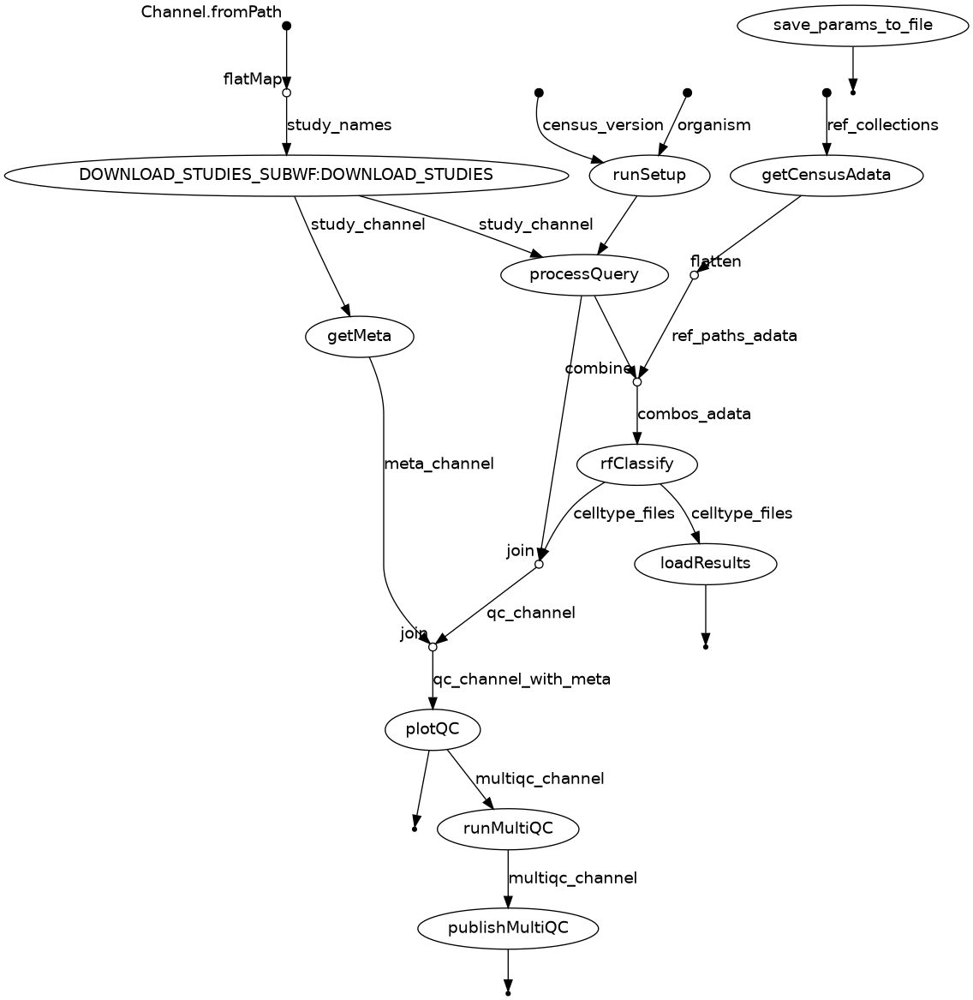

# Nextflow Pipeline for Single-Cell Data Processing and Classification

Nextflow pipeline designed to automatically annotate cell types from single-cell data loaded into the Gemma database. Cell types are assigned using a random forest classifier trained on `scvi` embeddings from the CellxGene data corpus [1][2][3].

## Table of Contents
- [Features](#features)
- [Requirements](#requirements)
- [Installation](#installation)
- [Usage](#usage)
- [Parameters](#parameters)
- [Input](#input)
- [Output](#output)
- [Workflow Description](#workflow_description)

---

## Features

- Downloads SCVI models based on organism and census version.
- Processes query datasets using SCVI models.
- Pulls reference datasets from CellxGene census data given an oranism and collection name.
- Performs cell type classification of query datasets using a random forest model.
- Summarizes QC metrics per-sample in a custome MutliQC report.
- Saves runtime parameters and outputs in a specified directory.

---

## Requirements

- **Nextflow** (=24.10.0)
- **Conda** (for environment management)
- My own conda environments are currently hard-coded into the pipeline (I will set up singularity environments in the future)
---


## Installation

1. Stable release is installed in:

```
/space/grp/Pipelines/sc-annotation-pipeline
```

## Usage 


To run re-annotation with from a list of study names with default parameters:

```
nextflow run sc-annotate.nf -profile conda -params-file params.mm.json --study_names <study_names_file.txt> 
```

To run with pre-downloaded MEX files, provide a path to a parent directory with all MEX files. If you only have one study, make sure to place it in a parent directory, or each sample will be trated as a separate Gemma experiment:

```
nextflow run sc-annotate.nf -profile conda -params-file params.mm.json --studies_path <path_to_gemma_experiments>
```

The `params.json` file can be passed instead of all command-line parameters. Inside `params.json`, you should declare the `ref_collections` parameter, as it is difficult to pass on the command line (see [Input](#input) section for details). Examples of the params file can be found in `params.hs.json` and `params.mm.json`. 

### Working directories and caching

Task hashes are stored by default in `.nextflow/cache`. Intermediate files for each pipeline run stored by default in the `work` directory. Both of these are necessary to resume your pipeline run with `-resume`. You can read more about caching and resuming with Nextflow [here](https://www.nextflow.io/docs/latest/cache-and-resume.html#work-directory).
`work-dir` is an optional parameter to keep the working directory for your pipeline runs separate. It's a good idea to delete your working directory when you're finished.

### Parameters

Parameters are configured in order of priority:
1. Command line arguments 
2. `params.json`
3. `nextflow.config`

So, 1 will override 2 and 2 will override 3.

Nextflow parameters begin with `-` (e.g. `-profile`; pipeline-specific parameters can be changed on the CLI with `--`).

To resume from the last completed step after an error, run:

```
nextflow run sc-annotate.nf -profile conda -resume -params-file <params file> -work-dir <working directory>
```

#### Defaults

Default parameters for mouse are as follows. You don't need to worry about the majority of these parameters; they have been defined for you in the appropriate `params.json` file (for human and mouse) or in the `nextflow.config` defaults. For reference: 

```
nextflow run sc-annotate.nf -profile conda \
  --organism mus_musculus \
  --census_version 2024-07-01 \
  --subsample_ref 500 \
  --nmads 5 \
  --studies_path test_mouse/ \
  --subsample_ref 500 \
  --ref_collections [
        "A taxonomy of transcriptomic cell types across the isocortex and hippocampal formation",
        "An integrated transcriptomic and epigenomic atlas of mouse primary motor cortex cell types",
        "Adult mouse cortical cell taxonomy revealed by single cell transcriptomics",
        "Tabula Muris Senis",
        "Single-cell transcriptomics characterization of oligodendrocytes and microglia in white matter aging"
    ] \
  --seed 42 \
  --cutoff 0 \
  --organ brain \
  --rename_file meta/rename_cells_mmus.tsv \
  --markers_file meta/cell_type_markers.tsv  \
  --author_annotations_path /space/grp/Pipelines/sc-annotation-pipelinecell_annotation_cortex.nf/meta/author_cell_annotations \
  --original_celltype_columns /space/grp/Pipelines/sc-annotation-pipelinecell_annotation_cortex.nf/meta/author_cell_annotations/original_celltype_columns.tsv \
  --gene_mapping /space/grp/Pipelines/sc-annotation-pipelinecell_annotation_cortex.nf/meta/gemma_genes.tsv \
  --multiqc_config /space/grp/Pipelines/sc-annotation-pipelinecell_annotation_cortex.nf/meta/multiqc_config.yaml \
  --version 1.1.0

```

## Input

A text file with the names of studies to be downloaded, annotated, and uploaded back to Gemma. Names are separated by newline. See `study_names_mouse.txt` for example. Alternatively, the path to a parent directory where sub-directories are experiments downloaded in MEX format from Gemma.

### Parameters

| Parameter                    | Description                                                                                                  |
|------------------------------|---------------------------------------------------------------------------------------------------------------|
| `--organism`                 | The species being analyzed (one of `homo_sapiens`, `mus_musculus`).                                           |
| `--census_version`           | The version of the single-cell census to use (do not change from default).                                    |
| `--outdir`                   | Directory where output files will be saved.                                                                   |
| `--study_names`              | Path to a file listing study names to include in the analysis. See `study_names_mouse.txt` for example.       |
| `--subsample_ref`            | Number of cells per cell type to subsample from the reference dataset.                                        |
| `--ref_collections`          | A space-separated list of quoted reference collection names to use for annotation.                            |
| `--seed`                     | Random seed for reproducibility of subsampling and processing.                                                |
| `--organ`                    | Organ to sample from CELLxGENE Census. Defaults to brain.                                                     |
| `--tissue`                   | Optional filter for brain region/tissue within organ. Defaults to None.                                       |
| `--rename_file`              | Tab- or comma-delimited file for renaming or selecting specific cell types.                                   |
| `--cutoff`                   | Minimum classification probability to assign a label to a cell (default = 0).                                 |
| `--markers_file`             | TSV or CSV file containing marker genes for cell types for QC plotting.                                       |
| `--original_celltype_columns`| Optional TSV file specifying original cell type columns to extract from author annotations.                   |
| `--author_annotations_path`  | Optional directory containing author-provided annotations for each study (provided by Rachel).                |
| `--gene_mapping`             | File mapping NCBI gene IDs to ENSEMBL or HGNC symbols using Gemma platform IDs.                               |
| `--multiqc_config`           | YAML configuration file to customize MultiQC output.                                                          |
| `--nmads`                    | Number of MADs for calling outliers in multiQC report.                                                        |
| `-params-file`               | JSON file specifying pipeline parameters.                                                                     |
| `-work-dir`                  | Directory for Nextflow to use as a working directory for intermediate files.                                  |


As of right now, experimental factors such as tissue or batch are not incorporated into the label transfer. The sample accession (i.e. each set of .mex files) is taken as the `batch_key` for the `scvi` forward pass.
See [Defaults](#defaults) for for default parameters. 

Please note that to change the organism to `homo_sapiens`, you should also change `--ref_collections` in `params.json` to:

```
    "ref_collections": [
        "Transcriptomic cytoarchitecture reveals principles of human neocortex organization", 
        "SEA-AD: Seattle Alzheimer’s Disease Brain Cell Atlas"
    ]
```

I have provided two `params.json` files to make this easier (`params.hs.json` and `params.mm.json`). Please do not change these files or `nextflow.config`; instead make a copy of the `.json` and pass it via the command line. Parameters can also be passed via command line arguments, which will override `params.json` (see [Parameters](#parameters)). However, as nextflow has trouble with parameter values which contain spaces, it's best to pass `ref_collections` via your `params.json`.

## Output

For each run, an output directory with the following structure will be written:

```
└── mus_musculus_subsample_ref_50_2025-01-15_17-51-37
     ├── ExperimentName_predicted_celltype.tsv
     └── message.txt
    ├── params.txt
    ├── multiqc 
```

one `params.txt` file stores parameters for cell type classification tasks on all of the given studies (e.g. GSE154208).
`message.txt` is the output of `'loadSingleCellData` command which uploaded `predicted_celltypes.tsv` to Gemma.

### MultiQC report

The pipeline will generate a custome MultiQC report for each experiment. This is a beta feature which may be expanded to flagging cells as outliers. See the following examples of experiments with high and low concordance between author cell type annotations and pipeline predictions:


1. [GSE180670](https://github.com/PavlidisLab/sc-annotation-pipeline/tree/development/images/multiqc/GSE180670) -- poor performance, according to authors these should all be Oligodendrocytes

2. [PTSD Brainomics](https://github.com/PavlidisLab/sc-annotation-pipeline/tree/development/images/multiqc/PTSDBrainomics) -- high performance according to benchmarking results (see github.com/rachadele/evaluation_summary.nf)

For more info on multiQC report, see 

## Workflow Description


   
## References

1. Lim N., et al., Curation of over 10,000 transcriptomic studies to enable data reuse. Database, 2021. 
2. CZI Single-Cell Biology Program, Shibla Abdulla, Brian Aevermann, Pedro Assis, Seve Badajoz, Sidney M. Bell, Emanuele Bezzi, et al. “CZ CELL×GENE Discover: A Single-Cell Data Platform for Scalable Exploration, Analysis and Modeling of Aggregated Data,” November 2, 2023. https://doi.org/10.1101/2023.10.30.563174.
3. Lopez, Romain, Jeffrey Regier, Michael B. Cole, Michael I. Jordan, and Nir Yosef. “Deep Generative Modeling for Single-Cell Transcriptomics.” Nature Methods 15, no. 12 (December 2018): 1053–58. https://doi.org/10.1038/s41592-018-0229-2.
