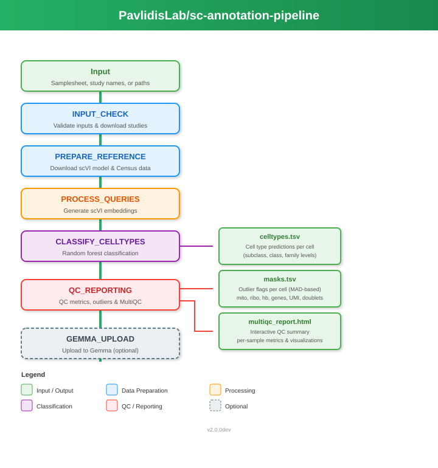

# Single-cell Re-annotation Pipeline for Human and Mouse Neocortex


Nextflow pipeline for automated single-cell cell type annotation using scVI embeddings and random forest classification. Designed to annotate cell types from single-cell data loaded into the [Gemma database](https://gemma.msl.ubc.ca). Cell types are assigned using a random forest classifier trained on scVI embeddings from the CellxGene data corpus<sup>1</sup><sup>2</sup><sup>3</sup>.




## Table of Contents

- [Pipeline Summary](#pipeline-summary)
- [Pipeline Structure](#pipeline-structure)
- [Requirements](#requirements)
- [Installation](#installation)
- [Quick Start](#quick-start)
- [Usage](#usage)
- [Parameters](#parameters)
- [Output](#output)
- [QC and Outlier Detection](#qc-and-outlier-detection)
- [References](#references)

---

## Pipeline Summary

1. **Input validation** - Validates study names or paths and downloads data if needed
2. **Reference preparation** - Downloads scVI model and pulls reference embeddings from CellxGene Census
3. **Query processing** - Generates scVI embeddings for query datasets
4. **Cell type classification** - Classifies cells using random forest on scVI embeddings
5. **QC reporting** - Generates QC metrics and MultiQC reports with outlier detection
6. **Gemma upload** (optional) - Uploads annotations to Gemma database

---

## Pipeline Structure

This pipeline follows [nf-core best practices](https://nf-co.re/docs/contributing/pipelines/pipeline_file_structure) with a modular architecture.

### Directory Layout


```
sc-annotation-pipeline-rachel-dev/
├── main.nf                      # Entry point
├── nextflow.config              # Main configuration
├── nextflow_schema.json         # Nextflow schema
├── workflows/
│   └── scannotate.nf            # Main workflow orchestration
├── subworkflows/
│   └── local/
│       ├── input_check/
│       ├── prepare_reference/
│       ├── process_queries/
│       ├── classify_celltypes/
│       ├── qc_reporting/
│       └── gemma_upload/
├── modules/
│   └── local/
├── conf/
│   ├── base.config              # Resource defaults (CPU/memory/time)
│   ├── modules.config           # Module-specific settings
│   ├── test_mmus.config         # Mouse test profile
│   └── test_hsap.config         # Human test profile
├── assets/                      # Reference files and configs
│   ├── samplesheet.csv
│   ├── cell_type_markers.tsv
│   └── ...
├── bin/                         # Python scripts
├── params.mm.json               # Mouse parameters
├── params.hs.json               # Human parameters
├── README.md
└── ...
```

### Subworkflows

| Subworkflow | Description |
|-------------|-------------|
| `INPUT_CHECK` | Validates inputs and downloads/prepares studies from Gemma |
| `PREPARE_REFERENCE` | Downloads scVI model and Census reference data |
| `PROCESS_QUERIES` | Processes query data through scVI model to generate embeddings |
| `CLASSIFY_CELLTYPES` | Random forest classification using reference embeddings |
| `QC_REPORTING` | QC analysis, outlier detection, and MultiQC report generation |
| `GEMMA_UPLOAD` | Uploads cell type annotations and QC masks to Gemma |

---


## Test Profiles

Two test profiles are provided:
- **test_mouse**: Runs a minimal pipeline test with mouse (Mus musculus) parameters.
- **test_human**: Runs a minimal pipeline test with human (Homo sapiens) parameters.
Use with `-profile test_mouse,conda` or `-profile test_human,conda`.

## Requirements

- **Nextflow** >= 23.04.0
- **Conda/Mamba** or **Singularity/Docker** for environment management

---

## Installation

Stable release is installed in:

```
/space/grp/Pipelines/sc-annotation-pipeline
```

For development:

```bash
git clone https://github.com/PavlidisLab/sc-annotation-pipeline.git
cd sc-annotation-pipeline
```

---

## Quick Start

```bash
# Using a samplesheet (recommended)
nextflow run main.nf -profile conda -params-file params.mm.json \
    --input samplesheet.csv

# Mouse studies (from study names)
nextflow run main.nf -profile conda -params-file params.mm.json \
    --study_names "GSE154208 GSE123456"

# Human studies (from paths)
nextflow run main.nf -profile conda -params-file params.hs.json \
    --study_paths "/path/to/study1 /path/to/study2"

# Run with human test profile
nextflow run main.nf -profile test_human,conda

# Run with mouse test profile
nextflow run main.nf -profile test_mouse,conda
```

---

## Usage

### Input Options

The pipeline supports three input methods:

1. **Samplesheet** (`--input`) - Recommended, most flexible
2. **Study names** (`--study_names`) - Download from Gemma by name
3. **Study paths** (`--study_paths`) - Use pre-downloaded local data

#### Using a Samplesheet (Recommended)

A samplesheet is a CSV file that allows you to mix studies to download and local paths in a single run.

**Format:**

```csv
sample,study_name,study_path
GSE154208,GSE154208,
GSE123456,GSE123456,
local_study,,/path/to/local/data
```

| Column | Required | Description |
|--------|----------|-------------|
| `sample` | Yes | Unique sample identifier |
| `study_name` | No* | Study name to download from Gemma |
| `study_path` | No* | Path to pre-downloaded MEX data, or a single pre-combined `.h5ad` file |

*At least one of `study_name` or `study_path` must be provided per row.

**Example usage:**

```bash
nextflow run main.nf -profile conda -params-file params.mm.json --input assets/samplesheet.csv
```

An example samplesheet is provided at `assets/samplesheet.csv`.

#### From Study Names (Legacy)

Download studies directly from Gemma by name:

```bash
# Space-separated list
nextflow run main.nf -profile conda -params-file params.mm.json \
    --study_names "experiment1 experiment2"

# Text file (one study per line)
nextflow run main.nf -profile conda -params-file params.mm.json \
    --study_names studies.txt
```

#### From Study Paths (Legacy)

Use pre-downloaded MEX data, without needing Gemma credentials:

```bash
# Space-separated list
nextflow run main.nf -profile conda -params-file params.mm.json \
    --study_paths "/data/gemma/experiment1 /data/gemma/experiment2"

# Text file (one path per line)
nextflow run main.nf -profile conda -params-file params.mm.json \
    --study_paths paths.txt
```

Each path can be either a directory of per-sample MEX subdirectories, or a single pre-combined `.h5ad` file. A directory containing more than one `.h5ad` file is not supported — the pipeline only accepts one `.h5ad` per study.

### Profiles

| Profile | Description |
|---------|-------------|
| `conda` | Use Conda for environment management |
| `docker` | Use Docker containers |
| `singularity` | Use Singularity containers |
| `apptainer` | Use Apptainer containers |
| `test_human` | Test configuration for human data |
| `test_mouse` | Test configuration for mouse data |

SLURM execution is enabled by default and does not require a separate profile.

Note: `singularity`/`apptainer` must be installed on every node SLURM dispatches jobs to, not just the login node, or jobs fail with `singularity: command not found`. Use `-profile conda` on such clusters, or `-process.executor local` to run containers on the login node directly.

### Resuming Pipelines

```bash
nextflow run main.nf -profile conda -resume -params-file params.mm.json
```

### Working Directory

Specify a custom work directory to keep intermediate files organized:

```bash
nextflow run main.nf -profile conda -work-dir /scratch/my_workdir ...
```

---

## Parameters

### Input/Output

| Parameter | Description | Default |
|-----------|-------------|---------|
| `--input` | Samplesheet CSV file (recommended) | `null` |
| `--study_names` | Study names (space-separated or file, legacy) | `null` |
| `--study_paths` | Study paths (space-separated or file, legacy) | `null` |
| `--outdir` | Output directory | Auto-generated with timestamp |
| `--publish_dir_mode` | Method for publishing files | `copy` |

### Reference Options

| Parameter | Description | Default |
|-----------|-------------|---------|
| `--organism` | Species (`mus_musculus` or `homo_sapiens`) | `mus_musculus` |
| `--census_version` | CellxGene Census version | `2024-07-01` |
| `--organ` | Organ to sample from Census | `brain` |
| `--subsample_ref` | Cells per cell type to subsample | `500` |
| `--ref_collections` | Reference collection names (list) | See params.json |
| `--ref_keys` | Reference annotation keys | `["subclass_cell_type", "class_cell_type", "family_cell_type"]` |

### Classification Options

| Parameter | Description | Default |
|-----------|-------------|---------|
| `--cutoff` | Min probability to assign label | `0` |
| `--seed` | Random seed | `42` |
| `--process_samples` | Process samples individually | `false` |
| `--preferredCtaLevel` | Preferred annotation level | `class` |

### QC Options

| Parameter | Description | Default |
|-----------|-------------|---------|
| `--nmads` | MADs for outlier detection (map with per-metric thresholds) | `[mito: 20, umi: 5, genes: 5, counts: 5]` |

The `nmads` parameter accepts a map with separate thresholds for each QC metric:
- `mito`: Mitochondrial content outliers
- `umi`: UMI count outliers
- `genes`: Gene count outliers
- `counts`: Counts relationship outliers (genes vs UMI linear model)

Override specific metrics on the command line:
```bash
nextflow run main.nf --nmads.mito 3 --nmads.counts 4
```

### Asset Files

| Parameter | Description |
|-----------|-------------|
| `--rename_file` | Cell type renaming/selection file |
| `--markers_file` | Marker genes for QC plotting |
| `--gene_mapping` | NCBI to ENSEMBL/HGNC mapping |
| `--multiqc_config` | MultiQC configuration |
| `--original_celltype_columns` | Original cell type column mapping |
| `--author_annotations_path` | Author-provided annotations directory |

### Gemma Options

| Parameter | Description | Default |
|-----------|-------------|---------|
| `--use_staging` | Use Gemma staging server | `true` |
| `--use_gemma` | Master switch — set `false` to skip all Gemma interaction (per-sample metadata fetch during QC and uploads). Needed for studies from `--study_paths`/local samplesheet rows that don't exist in Gemma | `true` |
| `--upload_cta` | Upload cell type annotations | `true` |
| `--upload_clc` | Upload cell-level characteristics | `true` |
| `--upload_mask` | Upload outlier mask | `true` |
| `--upload_multiqc` | Upload MultiQC report | `true` |

#### Cell Type Assignment Protocols

The specified `ctaProtocol` must exist in Gemma prior to upload. The ctaProtocol is determined by the pipeline version e.g. `sc-pipeline-2.0.0dev`. The corresponding ctaName is determined by a combintion of pipeline version and level of granularity, e.g. `sc-pipeline-2.0.0dev-class`. To create a ctaProtocol in gemma, run:

```
gemma-cli addProtocol --name "sc-pipeline-<new version>"
```

**Note:** Set `GEMMA_USERNAME` and `GEMMA_PASSWORD` environment variables for Gemma uploads.

### Parameter Files

Pre-configured parameter files are provided:

- `params.mm.json` - Mouse (mus_musculus)
- `params.hs.json` - Human (homo_sapiens)

Parameter priority: CLI arguments > params.json > nextflow.config

---

## Output

```
results/
└── mus_musculus_subsample_ref_500_2025-01-15_17-51-37/
    ├── celltypes/
    │   └── *_predicted_celltype.tsv    # Cell type predictions
    ├── masks/
    │   └── *_outlier_mask.tsv          # QC outlier masks
    ├── multiqc/
    │   └── multiqc_report.html         # QC summary report
    ├── pipeline_info/
    │   ├── execution_report.html       # Nextflow execution report
    │   ├── execution_timeline.html     # Timeline visualization
    │   ├── execution_trace.txt         # Resource usage trace
    │   └── pipeline_dag.dot            # Pipeline DAG
    └── versions/
        └── software_versions.yml       # Software versions used
```

---

## QC and Outlier Detection

### MultiQC Report

A custom MultiQC report is generated by `process_QC.py` for each experiment. Outliers are defined using Median Absolute Deviations (MAD) per-sample following <a href="https://www.sc-best-practices.org/preprocessing_visualization/quality_control.html">best practices</a><sup>4</sup>.

### Outlier Metrics

Cells are marked as outliers if:

$$
\lvert M_i - \mathrm{median}(M) \rvert > X \cdot \mathrm{MAD}(M)
$$

where $X$ is the NMAD threshold for that metric (configurable via `--nmads`) and $M_i$ is one of:

| Metric | scanpy field | nmads key | Default |
|--------|--------------|-----------|---------|
| Mitochondrial | `pct_counts_mito` | `mito` | 20 |
| Gene content | `log1p_n_genes_by_counts` | `genes` | 5 |
| UMI content | `log1p_total_counts` | `umi` | 5 |

**Note on mitochondrial threshold:** The default `mito` threshold is set higher (20 MADs) than other metrics because certain cell types (e.g., astrocytes)  exhibit higher mitochondrial gene expression. A stricter threshold can lead to disproportionate false-positive outlier calls for these cell types.

### Counts Outliers

"Counts" outliers are cells whose gene counts deviate from the expected log-linear relationship with UMI counts:

$$
r_i = \ln(\mathrm{genes}_i + 1) - \widehat{\ln(\mathrm{genes}_i + 1)}
$$

where fitted values come from: $\ln(\mathrm{genes}+1) \sim \ln(\mathrm{counts}+1)$

Outliers: $\lvert r_i - \mathrm{median}(r) \rvert > X \cdot \mathrm{MAD}(r)$

The threshold $X$ is controlled by `--nmads.counts` (default: 5).

### Doublet Detection

Doublets are predicted using the <a href="https://scanpy.readthedocs.io/en/stable/api/generated/scanpy.pp.scrublet.html">Scanpy implementation of Scrublet</a> <sup>Wolock et al., 2019</sup>.

---

## References

1. Lim N., et al., Curation of over 10,000 transcriptomic studies to enable data reuse. Database, 2021.
2. CZI Single-Cell Biology Program, et al. "CZ CELL×GENE Discover: A Single-Cell Data Platform for Scalable Exploration, Analysis and Modeling of Aggregated Data," November 2, 2023. https://doi.org/10.1101/2023.10.30.563174.
3. Lopez, Romain, et al. "Deep Generative Modeling for Single-Cell Transcriptomics." Nature Methods 15, no. 12 (December 2018): 1053–58. https://doi.org/10.1038/s41592-018-0229-2.
4. Heumos, L., Schaar, A.C., Lance, C. et al. Best practices for single-cell analysis across modalities. Nat Rev Genet (2023). https://doi.org/10.1038/s41576-023-00586-w
